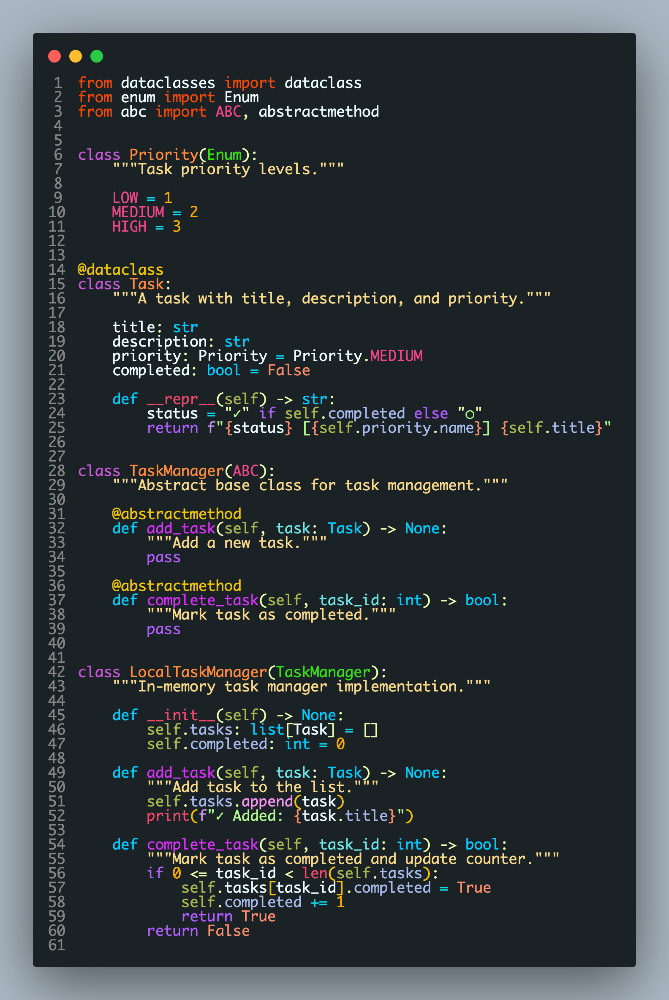
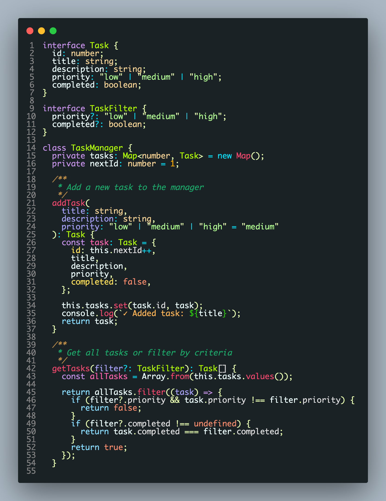

# Centurion VS Code Theme

A comprehensive dark theme for Visual Studio Code supporting 12+ programming languages with professional syntax highlighting across 98+ TextMate grammars.

## 🚀 Installation

### From VS Code Marketplace
1. Open VS Code
2. Go to Extensions (`Ctrl+Shift+X` / `Cmd+Shift+X`)
3. Search for "Centurion Theme"
4. Click **Install**
5. Select Centurion in Settings → Color Theme

### From VSIX File
```bash
code --install-extension centurion-vscode-theme-<version>.vsix
```

### Screenshots

  
*Centurion theme in action with Python code*

  
*TypeScript syntax highlighting*

## ✨ Features

- **Comprehensive Token Coverage**: 316+ mapped token scopes across 12+ programming languages.

- **WCAG AA Compliant**: All colors meet the 4.5:1 contrast ratio minimum for accessibility on dark backgrounds.

- **Semantic Token Support**: Full semantic token mapping for modern language servers and intelligent code analysis.

## 📋 Quick Start

### For Users
- Open VS Code Settings → Color Theme
- Select "Centurion" from the list
- Customize individual colors in `settings.json` if desired

## 🎨 Color Customization

To customize colors for your personal use, edit VS Code settings:

```json
{
  "workbench.colorTheme": "Centurion",
  "editor.tokenColorCustomizations": {
    "[Centurion]": {
      "comments": "#your-color",
      "strings": "#your-color",
      "keywords": "#your-color"
    }
  }
}
```

## 📝 License

This project is provided under the terms of the included `LICENSE` file.

---

**Have feedback?** Open an issue on GitHub. **Want to contribute?** Submit a pull request. **Found a bug?** Let us know!

**Happy coding! 🎨**
